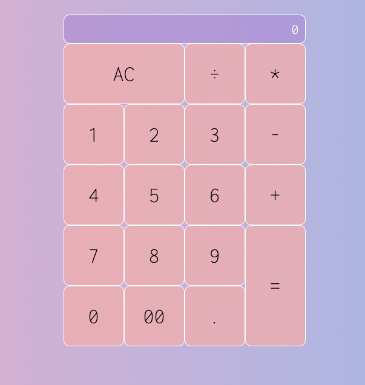

# CALCULATOR

This calculator was made by a tutorial, 
Made in CSS, HTML and JavaScript.

### Things I learned
1. How to use dataset property to obatin an attribute.
2. How to use event.target property to implement event delegation
3. How to use classList element to accessing an element's list of classes.
4. How to use addEventListener
5. The proper way to use grid
6. How to use data-action and the importance of using data attributes

## Contact :fax:

* GitHub [@susird](https://github.com/SUSIRD)
* Twitter [@ve5pula](https://twitter.com/ve5pula)
* Linkedin [susana-rd](https://www.linkedin.com/in/susana-rd/)
